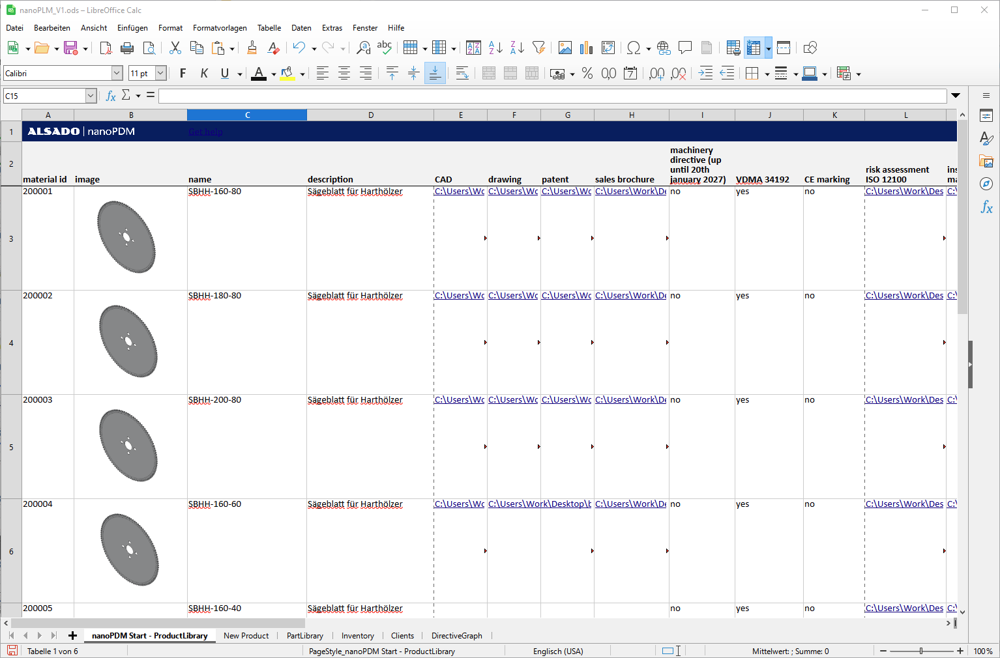

# we-have-PDM-at-home
An open-source workflow for product data management, comprised of FreeCAD, LibreOffice and subversion (VisualSVN Server and Tortoise SVN)

## Getting started with PDM as a small manufacturer

> PDM, or product data management, systems can feel like a big hassle for small manufacturers and many don't think its necessary.
>
> And they are probably correct.
>
>  However, these small manufacturers don't need to go to a full fledged PDM system right away.
>
> Small manufacturers often don't need to manage data for 1000s of components.
>
> Instead of making a big jump and massively disrupt their business processes, small manufacturers can get started by managing their product data with just a spreadsheet.
>
> The spreadsheet can be created in LibreOffice Calc using an open data format. This allows manufacturers to rely on being able to open the file even many years in the future.
>
> What is even better - combining that LibreOffice Calc sheet with a version control system, like subversion. A versioning system like subversion can be implemented company-wide with a central VisualSVN Server and TortoiseSVN clients.
>
> This way manufacturers can manage multiple versions of their products, assign roles to their employees and lock/ check-in/ checkout their files, like CAD-files from FreeCAD.
>
> This enables version control, user roles, locking/ checking in and out and FreeCAD CAD file management - covering the most important features in a PDM.
>
> -- <cite>Aleksander Sadowski</cite>

## Overview of the open-source-software suite at use:
- FreeCAD
- LibreOffice Calc
- VisualSVN Server
- TortoiseSVN
